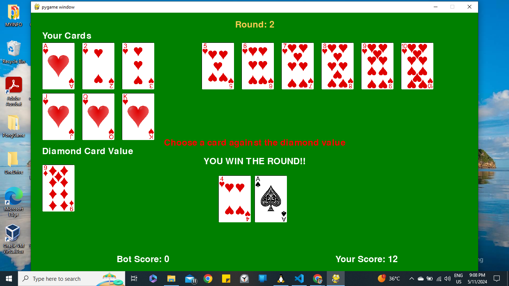

# Diamond Game

The Diamond Game is a strategic card game where players compete against each other to win rounds by choosing the most optimal card against a diamond card value.


<!-- Add some space between the images -->
<br><br>




## Rules of the Game

1. **Objective**: 
The objective of the Diamond Game is to strategically choose cards to win rounds and accumulate the highest total score after 13 rounds.

2. **Players**: The game will be played between two players - the user (human player) and the bot (computer player).

3. **Card Values**:
   - Each card in the deck has a specific value.
   - The diamond card value is randomly chosen at the beginning of each round.
   - The values of the cards are as follows:
     - Ace: 1
     - 2 to 10: Face value (e.g., 2 has a value of 2, 10 has a value of 10)
     - Jack: 11
     - Queen: 12
     - King: 13

4. **Round Process**:
   - At the start of each round, a diamond card value is randomly chosen.
   - Both players (user and bot) choose a card from their respective decks without showing it to the other player.
   - Once both the players are done with choosing their cards, they show their cards.
   - So Cards have to be secretly chosen and be shown to the other player only in the end for evaluation.
   - Of The 2 players the one with the highest card value wins the round and the diamond card's value is added to the player's score.
   - If both players choose cards with equal values, it results in a tie, and points are distributed equally for that round.
   - The player with the highest total score after 13 rounds wins the game.

5. **Scoring**:
   - Each round win awards the diamond card value point to the winning player.
   - In case of a tie, the diamond card value is distributed between the user and the bot.
   - The score is displayed at the end of each round to track the progress.

6. **Game End**:
   - The game ends after all the diamond cards are exhausted so after 13 rounds.

# How to Play
## Diamond Game Requirements

This game requires the following dependencies to run:

- Python (latest version)
- Pygame (latest version)

If you are using WSL (Windows Subsystem for Linux), you also need to download and install Xming X Server.

## Installation Steps

1. Install Python:
   - Download and install the latest version of Python from [python.org](https://www.python.org/downloads/).

2. Install Pygame:
   - Once Python is installed, open a terminal or command prompt.
   - Run the following command to install Pygame:
     ```
     pip install pygame
     ```

3. (WSL Only) Install Xming X Server:
   - Download Xming X Server from [Xming website](https://sourceforge.net/projects/xming/).
   - Install Xming following the installation instructions provided.

## Running the Game

After installing Python, Pygame, and Xming (if using WSL), follow these steps to run the Diamond Game:

1. Clone or download the game repository from GitHub.
2. Navigate to the game directory in your terminal or command prompt.
3. Run the following command to start the game:
    ```python3
   python3 ui.py
   ```
   or
   ```python
   python ui.py
   ```
  
4. Follow the on-screen instructions to proceed through each round.
5. Choose your card wisely to maximize your chances of winning each round.
6. Keep track of your score and aim to outscore your opponent by choosing strategic cards.

Enjoy playing the Diamond Game and have fun strategizing to win each round!
